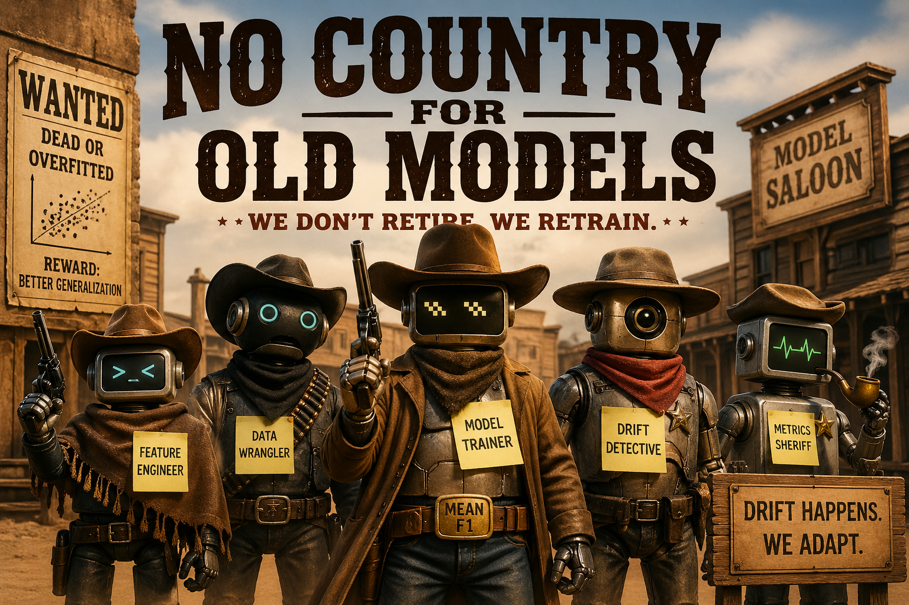

# Agentic ModelOps for Fraud Detection



An agentic ModelOps system that turns a deployed ML model into a self-monitoring, self-improving system.

Instead of static pipelines and scheduled retraining, this project uses multiple agents to observe production behavior, reason about drift and performance degradation, decide when retraining is justified, and safely govern model deployment.

While a credit card fraud detection model is used as a working example, the real focus is the architecture: FastAPI-based serving combined with a LangGraph-powered multi-agent system that manages the full ML lifecycle autonomously.

The guiding idea is simple: production data changes, so the system should observe, reason, and adapt.

## Vision

This project is being built as a practical ModelOps loop:

```text
Train baseline
    -> deploy active model
    -> serve predictions
    -> log production traffic
    -> monitor performance and drift
    -> agent decides next action
    -> diagnose issue
    -> retrain candidate
    -> evaluate candidate
    -> governance decision
    -> promote or reject
    -> continue monitoring
```

The final goal is not just a model training script. It is a small, inspectable fraud-model operations platform where agents can use tools, reports, and deployment metadata to make structured operational decisions.

## Planned System Architecture

```text
                         +----------------------------+
                         | Raw Data / Production Feed |
                         +-------------+--------------+
                                       |
                                       v
                         +----------------------------+
                         | FastAPI Inference Service  |
                         | src/serving/app.py         |
                         +-------------+--------------+
                                       |
                                       v
                         +----------------------------+
                         | Active Model Deployment    |
                         | model + metadata + encoder |
                         +-------------+--------------+
                                       |
                                       v
                         +----------------------------+
                         | SQLite ModelOps Store      |
                         | deployments + predictions  |
                         +-------------+--------------+
                                       |
             +-------------------------+--------------------------+
             |                                                    |
             v                                                    v
  +------------------------+                         +------------------------+
  | Performance Monitor    |                         | Drift Detector         |
  | precision/recall/F1    |                         | feature/pred drift     |
  +------------+-----------+                         +------------+-----------+
               |                                                  |
               +--------------------------+-----------------------+
                                          v
                             +--------------------------+
                             | Unified Monitoring Report|
                             +------------+-------------+
                                          |
                                          v
                             +--------------------------+
                             | Agentic Decision Layer   |
                             +------------+-------------+
                                          |
          +-------------------------------+-------------------------------+
          |                               |                               |
          v                               v                               v
  +----------------+              +----------------+              +----------------+
  | Watch/Continue |              | Diagnose/Retrain|             | Escalate/Human |
  +----------------+              +-------+--------+              +----------------+
                                          |
                                          v
                             +--------------------------+
                             | Candidate Retraining     |
                             | data + preprocessing     |
                             +------------+-------------+
                                          |
                                          v
                             +--------------------------+
                             | Candidate Evaluation     |
                             +------------+-------------+
                                          |
                                          v
                             +--------------------------+
                             | Deployment Governance    |
                             | promote / reject         |
                             +--------------------------+
```

## Current Status

Implemented:

- Baseline LightGBM fraud model training.
- FastAPI prediction service.
- SQLite prediction logging.
- Active deployment registry with `model_deployments`.
- Version-aware prediction logs with `deployment_id`.
- Production traffic simulation.
- Deployment-scoped performance monitoring.
- Deployment-scoped drift detection.
- Version-scoped monitoring reports.
- Monitoring agent tools.
- Diagnostic/retraining tool scaffolding.
- Initial retraining module structure under `src/retraining/`.

In progress:

- Raw-data-first preprocessing pipeline.
- Candidate retraining using raw baseline data plus labeled production logs.
- Candidate-owned preprocessing artifacts.
- Candidate evaluation and promotion criteria.
- Diagnostic retraining agent decision loop.

Planned:

- Deployment governance agent.
- Human approval gates.
- Candidate promotion into active deployment.
- Better model registry lifecycle states.
- Raw production log export.
- Stronger validation around data quality, schema drift, and leakage prevention.

## Repository Layout

```text
src/
  agents/
    graph.py
    prompts.py
    schemas.py
    state.py
    nodes/
      monitoring_agent.py
      monitoring_decision.py
      diagnostic_retraining_agent.py
      diagnostic_retraining_decision.py
      deployment_governance_agent.py
    tools/
      monitoring_tools.py
      diagnostic_retraining_tools.py

  config/
    settings.py

  logging/
    db.py
    prediction_logger.py

  monitoring/
    performance_monitor.py
    drift_detector.py
    monitoring_report.py

  retraining/
    data_builder.py
    preprocessor.py
    candidate_pipeline.py

  serving/
    app.py
    model_service.py
    schemas.py

  simulation/
    traffic_simulator.py

  training/
    dataset.py
    evaluator.py
    model_registry.py
    model_trainer.py

scripts/
  train_baseline.py
  simulate_production_traffic.py
  check_logs.py
  run_monitoring.py
  run_drift_detection.py
  generate_monitoring_report.py
  run_agent_graph.py
```

## Data and Artifact Design

The intended final layout separates raw data, processed data, model artifacts, and reports by version.

```text
data/
  raw/
    baseline_v1/
      train.csv
      validation.csv
      production_simulation.csv

  processed/
    baseline_v1/
      train.csv
      validation.csv

  candidates/
    candidate_<timestamp>/
      raw_combined.csv
      train.csv
      validation.csv

models/
  current/
    baseline_v1/
      model.pkl
      metadata.json
      label_encoders.pkl
      preprocessing_metadata.json

  candidates/
    candidate_<timestamp>/
      model.pkl
      metadata.json
      label_encoders.pkl
      preprocessing_metadata.json

reports/
  metrics/
    baseline_v1/
      metrics.json
      monitoring_report.json
      drift_report.json
      unified_monitoring_report.json

  candidates/
    candidate_<timestamp>/
      metrics.json
      candidate_summary.json
```

The current project is moving toward this structure. Some older files may still exist at legacy paths while the refactor is in progress.

## Model Deployment Versioning

Deployments are tracked in SQLite:

```text
model_deployments
- id
- model_version
- model_path
- metadata_path
- preprocessing_path
- metrics_path
- trained_at
- deployed_at
- training_data_cutoff_timestamp
- is_active
- status
```

Prediction logs are linked to deployments:

```text
prediction_logs
- id
- timestamp
- model_version
- deployment_id
- features_json
- fraud_probability
- prediction
- decision_threshold
- actual_label
```

This lets the system preserve historical logs while monitoring only the active deployment:

```sql
WHERE deployment_id = ?
```

## Baseline Workflow

Train and register the baseline deployment:

```bash
python scripts/train_baseline.py
```

Start the API:

```bash
uvicorn src.serving.app:app --reload
```

Check the active model:

```bash
curl http://localhost:8000/health
```

Simulate production traffic:

```bash
python scripts/simulate_production_traffic.py
```

Inspect deployments and logs:

```bash
python scripts/check_logs.py
```

Generate monitoring reports:

```bash
python scripts/run_monitoring.py
python scripts/run_drift_detection.py
python scripts/generate_monitoring_report.py
```

Run the agent graph:

```bash
python scripts/run_agent_graph.py
```

## Agent Roles

### Monitoring Agent

Responsible for deciding whether the active production model is:

- healthy
- watch
- diagnose
- escalate

It uses monitoring reports, traffic stats, drift reports, and retraining metadata.

### Diagnostic Retraining Agent

Responsible for investigating whether degradation is caused by:

- feature drift
- prediction drift
- data quality issues
- schema mismatch
- stale model behavior

It will trigger candidate retraining when evidence supports it.

### Deployment Governance Agent

Planned role responsible for promotion decisions:

- compare candidate and champion metrics
- enforce approval gates
- check minimum recall/precision/F1 requirements
- prevent unsafe automatic promotion
- register promoted candidates as active deployments

## Retraining Design

The intended retraining flow is raw-data-first:

1. Load baseline raw train and validation data.
2. Load labeled production logs for the active deployment.
3. Combine them into a candidate raw dataset.
4. Split into candidate train and validation.
5. Fit preprocessing on candidate train only.
6. Transform candidate train and validation.
7. Save candidate processed data.
8. Save candidate preprocessing artifacts.
9. Train candidate model.
10. Evaluate candidate model.
11. Compare candidate against active deployment.
12. Promote only if governance rules pass.

Important rules:

- Production simulation should send raw features to the API.
- The API should log raw request features.
- `prepare_input()` should transform raw features for inference.
- Validation data must never be used to fit preprocessing.
- Candidate models must own their preprocessing artifacts.
- Monitoring after promotion should only use logs from the new active deployment.

## Monitoring Reports

Reports are intended to be version-scoped:

```text
reports/metrics/<model_version>/
  monitoring_report.json
  drift_report.json
  unified_monitoring_report.json
```

The unified report combines:

- active deployment metadata
- baseline/current model metrics
- production performance metrics
- drift metrics
- recommendation
- agent decision placeholder

## Development Commands

Useful commands:

```bash
python -m compileall src scripts
python scripts/train_baseline.py
python scripts/check_logs.py
uvicorn src.serving.app:app --reload
python scripts/simulate_production_traffic.py
python scripts/run_monitoring.py
python scripts/run_drift_detection.py
python scripts/generate_monitoring_report.py
python scripts/run_agent_graph.py
```

## Roadmap

- Rebuild notebook preprocessing so production simulation remains raw.
- Save raw baseline splits under `data/raw/baseline_v1/`.
- Save processed baseline splits under `data/processed/baseline_v1/`.
- Move reusable preprocessing logic out of the notebook.
- Complete `src/retraining/preprocessor.py`.
- Complete `src/retraining/candidate_pipeline.py`.
- Slim down `diagnostic_retraining_tools.py` so it calls retraining services.
- Implement candidate promotion.
- Implement deployment governance node and tools.
- Add tests for DB migrations, model loading, logging, monitoring filters, and candidate retraining.

## Project Motto

> No country for old models. Drift happens. We adapt.

